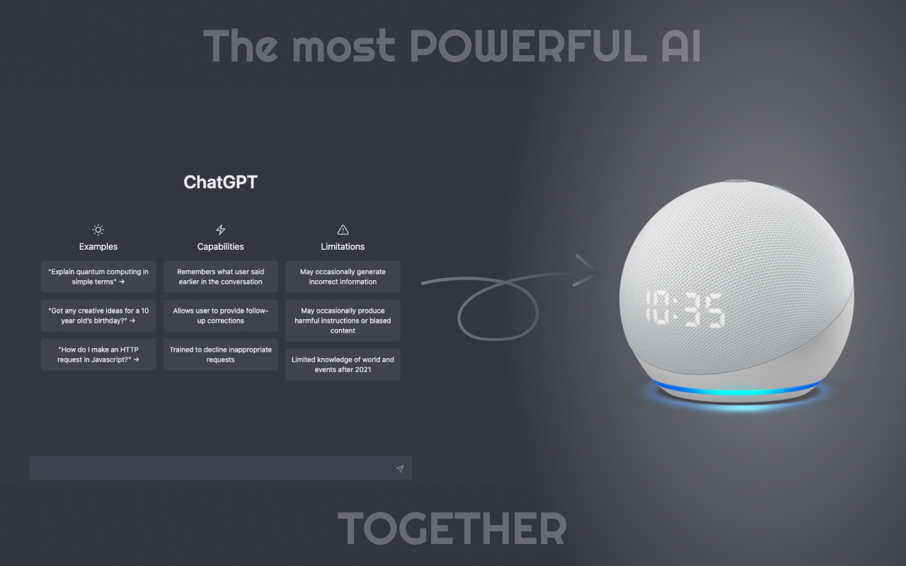

# Skill Alexa com ChatGPT

<p align="center">
  
</p>

Este repositório contém um exemplo de como usar o modelo de linguagem ChatGPT da OpenAI para criar uma Skill para Alexa.

## Como funciona

Este código se conecta à API do ChatGPT da OpenAI e envia as perguntas da Alexa para o modelo, que as processa e retorna as respostas. Em seguida, essas respostas são transmitidas de volta à Alexa e apresentadas ao usuário.

## Configuração

Você precisará obter uma chave API da OpenAI para usar o modelo ChatGPT. Mais informações sobre como fazer isso podem ser encontradas na documentação da API da OpenAI.

Uma vez que você tenha sua chave API, basta inseri-la no arquivo index.js no lugar indicado.

## Executando o exemplo

Este exemplo foi desenvolvido usando o ASK CLI da Amazon. Para executá-lo, você precisará instalar o ASK CLI e configurar sua conta da Amazon Developer.

Depois de configurado, basta executar os seguintes comandos no terminal:

```bash
ask init
ask deploy
```

Isso irá implantar sua Skill na sua conta da Amazon Developer e torná-la disponível para uso com a Alexa.

### Considerações finais

Este é apenas um exemplo básico de como usar o ChatGPT com a Alexa. Você pode expandir essa implementação para criar habilidades mais complexas e personalizadas. Aproveite!
